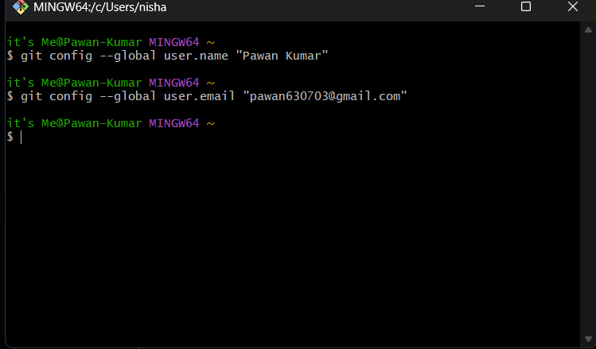
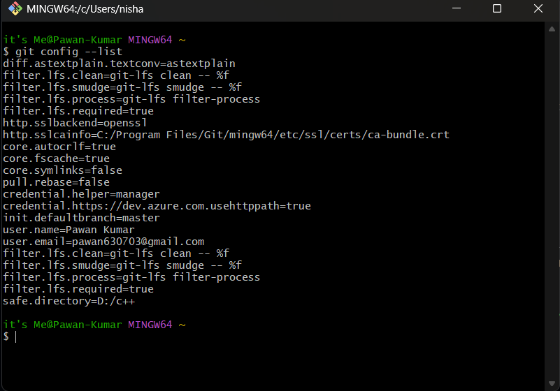
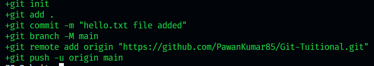
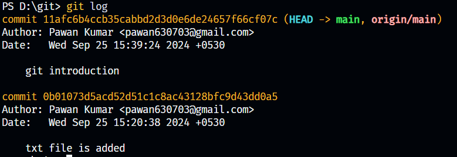
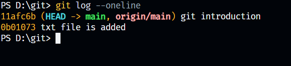
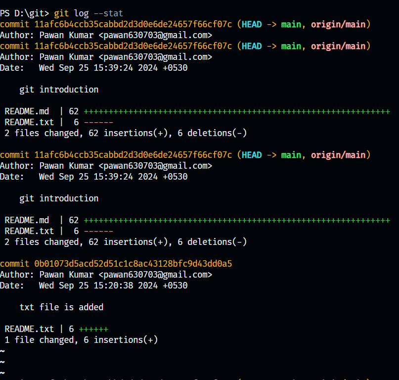
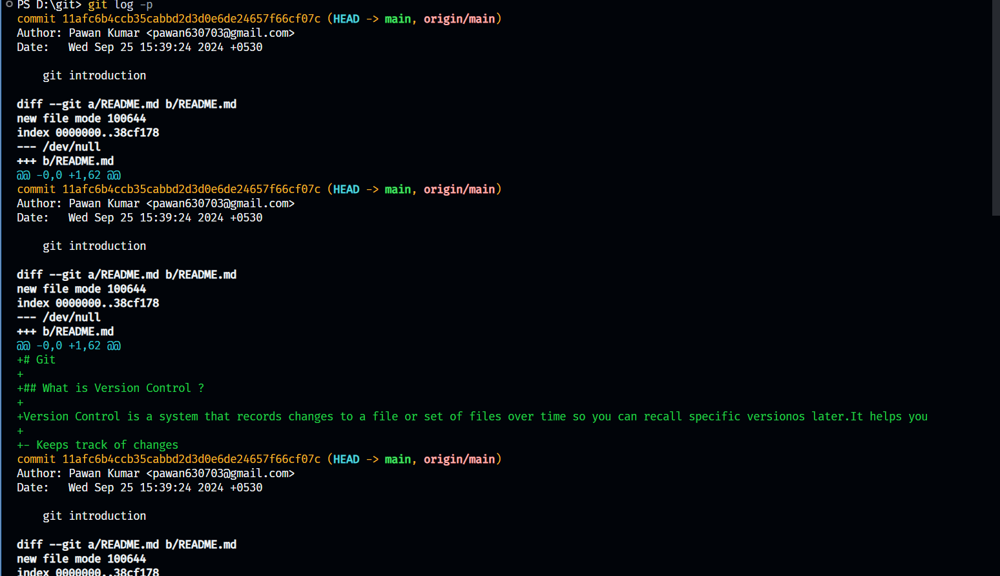
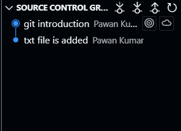

# Git

## What is Version Control ?

Version Control is a system that records changes to a file or set of files over time so you can recall specific versionos later.It helps you

- Keeps track of changes
- Collaborates with Other
- Revert to previous version

## What is Git Version Control ?

Git is a distributed Version Control system `(DVCS)` that allow multiple people to work on a project without interfering with each Other's changes.It provides tools to manage source code history and handle collaboration.

## Setting up git

```bash
git config --global user.name "Pawan Kumar"
git congit --global user.email "pawan630703@gmail.com"
```



### To sell all the configuration

```bash
    git config --list
```



## Basic git Commands

```bash
git init
git add .
git commit -m "message"
git branch -M <branch name>  // by default main branch
git remote add origin "https://github.com/PawanKumar85/Git-Tuitional.git"
git push -u origin main
```



For first time :

```bash
git remote add origin <github_repo_link>
git push -u origin <branch name>
```

For Second time :

```bash
git add .
git commit -m "your message"
git push    // if you want to push your main branch
```

### Note

```bash
    git add .  // select all

    or

    git add <filename> // select file with name
```

## Viewing Commit History in Detail

1. Basic gitlog command

- This command shows a list of commits in reverse chronological order.

    ```bash
    git log
    ```



- Detailed Commit History with git log Options

    Show commit history in one-line summary.

```bash
git log --oneline
```



- Show Detailed commit information (made,author,date,commit,message)

```bash
    git log -stat
```



- Show commit differences
    Show the patch(diff) for each commit,displaying the changes moade in each file.

```bash
git log -p
```



- Graphical Representation of Branches and Merges

```bash
git log --online --graph --decorate --all
```

`--graph` Adds a graphical representation



## Rever

1. Revering the single commit

```bash
    git log
    git revert <commit hash code>
    
    if(revert config occers)
    {
       1. resolve the conflict
        git add <file name>
        git revert --continue
    }
    git push <branch name>
```
